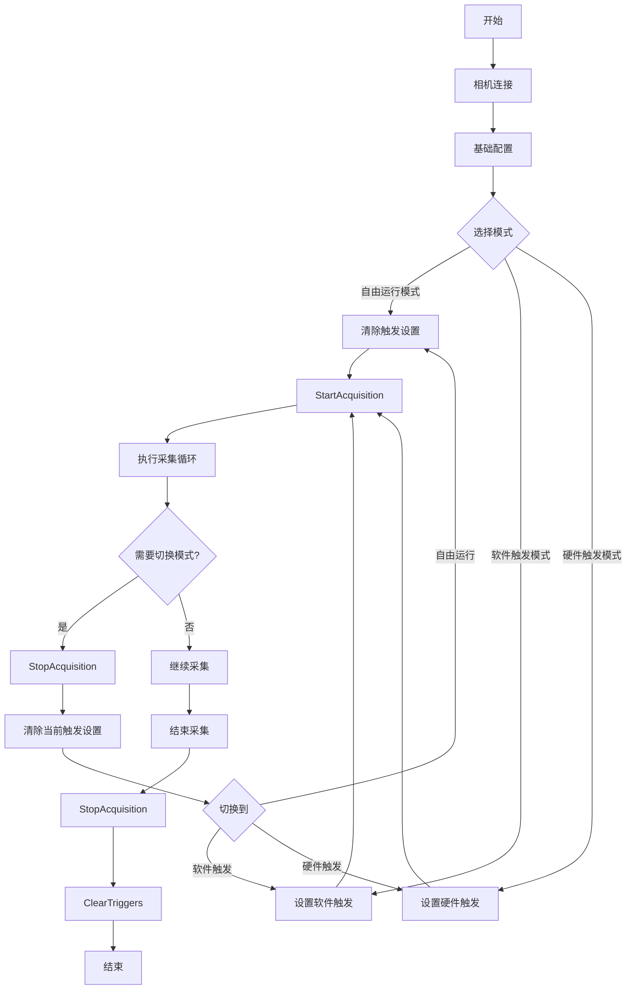

# 相机软件触发采集循环优化指南

## 🎯 核心原则

**性能最优 + 无超时 + 资源安全**

## 🔄 循环结构设计

### **循环外部 (一次性初始化)**
```csharp
// 1. 触发配置
camera.SetTrigger("Software");

// 2. 网络和流配置
if (camera.IsGigEVisionDevice())
{
    camera.GvAutoPacketSize();
}
using var stream = camera.CreateStream();
if (camera.IsGigEVisionDevice())
{
    stream.ConfigureGigEDefaults();
}

// 3. 相机启停 (关键!)
camera.StartAcquisition();
Thread.Sleep(200); // 让相机准备就绪
```

### **循环内部 (轻量重复)**
```csharp
for (int round = 1; round <= 3; round++)
{
    // 每轮创建新缓冲区 (避免生命周期冲突)
    for (int i = 0; i < framesPerRound; i++)
    {
        var buffer = new AravisSharp.Buffer(new IntPtr(payloadSize));
        stream.PushBuffer(buffer); // 流接管缓冲区所有权
    }
    
    // 执行触发采集
    for (int i = 0; i < framesPerRound; i++)
    {
        camera.SoftwareTrigger();
        var buffer = stream.PopBuffer(5000);
        if (buffer?.Status == ArvBufferStatus.Success)
        {
            // 立即返回缓冲区到流
            stream.PushBuffer(buffer);
        }
    }
}
```

### **循环外部 (最终清理)**
```csharp
camera.StopAcquisition();
// 流会自动清理缓冲区，无需手动释放
camera.ClearTriggers();
```

## ⚠️ 关键注意事项

### **缓冲区管理**
- ✅ **数量匹配**: 缓冲区数量 ≥ 每轮帧数
- ✅ **及时回收**: 每帧处理后立即 `stream.PushBuffer(buffer)`
- ✅ **所有权清晰**: `PushBuffer()` 后流拥有缓冲区，不要手动释放

### **相机状态管理**
- ✅ **单次启停**: 整个循环只启动/停止一次采集
- ✅ **避免重复初始化**: 流、网络配置等只执行一次
- ✅ **适当延迟**: 启动采集后给相机准备时间

### **错误处理**
- ✅ **超时设置**: 合理的超时时间 (如5秒)
- ✅ **状态检查**: 检查 `buffer.Status`
- ✅ **资源清理**: 使用 `using` 确保流正确释放

## 🚫 常见错误

### **缓冲区不足导致超时**
```csharp
// ❌ 错误: 缓冲区少于帧数
var buffers = new List<Buffer>();
for (int i = 0; i < 5; i++) // 只有5个缓冲区
    buffers.Add(new Buffer(size));

// ✅ 正确: 缓冲区数量匹配帧数
for (int i = 0; i < 10; i++) // 10个缓冲区对应10帧
    buffers.Add(new Buffer(size));
```

### **重复释放资源**
```csharp
// ❌ 错误: 手动释放已被流接管的缓冲区
stream.PushBuffer(buffer); // 流接管所有权
buffer.Dispose(); // 重复释放！

// ✅ 正确: 让流自动管理
stream.PushBuffer(buffer); // 流接管，无需手动释放
```

### **频繁启停相机**
```csharp
// ❌ 错误: 每轮都启停相机
for (int round = 1; round <= 3; round++)
{
    camera.StartAcquisition(); // 性能开销大
    // ... 采集
    camera.StopAcquisition();
}

// ✅ 正确: 单次启停
camera.StartAcquisition();
for (int round = 1; round <= 3; round++)
{
    // ... 采集
}
camera.StopAcquisition();
```

## 📊 性能对比

| 方案 | 执行时间 | 超时情况 | 资源安全 | 适用场景 |
|------|---------|----------|----------|----------|
| 原始方案 | 慢 | 严重超时 | 有警告 | ❌ 不推荐 |
| 优化方案 | 快 | 无超时 | 无警告 | ✅ 推荐 |

## 🔧 调试技巧

1. **缓冲区监控**: 记录每轮缓冲区使用情况
2. **帧ID检查**: 观察帧ID连续性判断是否有丢帧
3. **超时分析**: 记录超时发生的具体位置
4. **资源泄漏**: 监控GLib警告信息

## ⏰ 超时原因分析

### **缓冲区相关超时**

#### 1. **缓冲区数量不足**
- **现象**: 前N帧成功，第N+1帧开始超时 (N=缓冲区数量)
- **原因**: 所有缓冲区都在使用中，无空闲缓冲区接收新帧
- **解决方案**: 确保 `缓冲区数量 ≥ 预期采集帧数`
- **调试方法**: 记录每轮成功帧数，观察是否等于缓冲区数量

#### 2. **缓冲区未及时回收**
- **现象**: 随着采集进行，成功帧数逐渐减少
- **原因**: 缓冲区被Pop后未Push回流，导致可用缓冲区减少
- **解决方案**: 每帧处理后立即 `stream.PushBuffer(buffer)`
- **调试方法**: 监控流中缓冲区数量变化

#### 3. **缓冲区生命周期冲突**
- **现象**: 随机超时，可能伴随GLib警告
- **原因**: 缓冲区被重复释放或释放时机不当
- **解决方案**: 明确缓冲区所有权，避免手动释放流接管的缓冲区
- **调试方法**: 检查GLib-GObject警告信息

### **相机状态相关超时**

#### 4. **相机未正确启动**
- **现象**: 所有帧都超时
- **原因**: 忘记调用 `camera.StartAcquisition()` 或调用时机不当
- **解决方案**: 确保在触发前正确启动采集
- **调试方法**: 检查相机状态和触发配置

#### 5. **触发配置错误**
- **现象**: 所有帧都超时
- **原因**: 触发模式配置错误，相机不响应软件触发
- **解决方案**: 验证 `camera.SetTrigger("Software")` 配置正确
- **调试方法**: 检查 `camera.GetTriggerSource()` 返回值

#### 6. **相机准备不足**
- **现象**: 第一轮正常，后续轮次超时
- **原因**: 相机启动后立即触发，相机未完全准备就绪
- **解决方案**: 启动采集后添加适当延迟 `Thread.Sleep(200)`
- **调试方法**: 增加启动延迟测试

### **网络和硬件相关超时**

#### 7. **GigE网络问题**
- **现象**: 随机超时，可能伴随丢包
- **原因**: 网络延迟、丢包、带宽不足
- **解决方案**: 
  - 优化网络配置 `GvAutoPacketSize()`
  - 增加流缓冲区大小 `ConfigureGigEDefaults()`
  - 检查网络硬件和连接
- **调试方法**: 使用 `GetGigEStatistics()` 检查丢包情况

#### 8. **USB带宽不足**
- **现象**: 高分辨率或高帧率时超时
- **原因**: USB总线带宽不足
- **解决方案**:
  - 降低分辨率或帧率
  - 使用USB3.0接口
  - 减少同时运行的设备
- **调试方法**: 监控USB带宽使用情况

### **软件逻辑相关超时**

#### 9. **死锁或竞争条件**
- **现象**: 随机超时，程序可能卡死
- **原因**: 多线程访问共享资源时未正确同步
- **解决方案**: 避免多线程同时操作同一个流
- **调试方法**: 检查线程安全性和同步机制

#### 10. **资源泄漏累积**
- **现象**: 随着运行时间增加，超时频率增加
- **原因**: 内存泄漏、句柄泄漏等导致系统资源耗尽
- **解决方案**: 正确释放所有资源，使用using语句
- **调试方法**: 监控系统资源使用情况

### **超时调试流程**

1. **检查缓冲区**: 确认数量足够且及时回收
2. **验证相机状态**: 确保正确启动和配置
3. **监控网络**: 检查丢包和延迟
4. **分析日志**: 记录详细的超时信息
5. **逐步排查**: 从简单场景开始，逐步增加复杂度

## 🔄 模式切换流程图

### **自由运行模式 ↔ 触发模式切换**



### **模式切换关键步骤**

#### **切换到自由运行模式**
```csharp
// 1. 停止当前采集
camera.StopAcquisition();

// 2. 清除所有触发设置
camera.ClearTriggers();

// 3. 重新启动采集（自由运行）
camera.StartAcquisition();
```

#### **切换到软件触发模式**
```csharp
// 1. 停止当前采集
camera.StopAcquisition();

// 2. 清除现有设置
camera.ClearTriggers();

// 3. 配置软件触发
camera.SetTrigger("Software");

// 4. 重新启动采集
camera.StartAcquisition();
Thread.Sleep(200); // 让相机准备
```

#### **切换到硬件触发模式**
```csharp
// 1. 停止当前采集
camera.StopAcquisition();

// 2. 清除现有设置
camera.ClearTriggers();

// 3. 配置硬件触发
camera.SetTrigger("Line0"); // 或其他硬件触发源

// 4. 重新启动采集
camera.StartAcquisition();
Thread.Sleep(200); // 让相机准备
```

### **模式切换时机**

#### ✅ **推荐切换时机**
- **采集循环开始前**: 最安全，避免状态冲突
- **采集循环结束后**: 确保完整采集周期
- **相机空闲时**: 避免切换过程中的数据丢失

#### ⚠️ **避免切换时机**
- **采集过程中**: 可能导致数据丢失或超时
- **缓冲区操作时**: 可能导致资源冲突
- **网络传输中**: 可能导致数据包丢失

### **模式特性对比**

| 特性 | 自由运行模式 | 软件触发模式 | 硬件触发模式 |
|------|-------------|-------------|-------------|
| 采集控制 | 连续自动 | 软件命令控制 | 外部信号控制 |
| 切换复杂度 | 简单 | 中等 | 中等 |
| 适用场景 | 视频录制 | 精确控制 | 外部同步 |
| 缓冲区需求 | 较多 | 匹配触发次数 | 匹配触发次数 |
| 超时风险 | 低 | 中等 | 依赖外部信号 |

### **最佳实践**

1. **统一配置入口**: 创建模式配置函数
2. **状态验证**: 切换前后验证相机状态
3. **错误处理**: 添加适当的异常处理和重试机制
4. **资源清理**: 确保切换时正确释放资源
5. **日志记录**: 记录模式切换操作便于调试

## 🧪 模式切换实战经验

### **成功切换的关键步骤**

#### **完整的模式切换流程**
```csharp
// 1. 停止当前采集
camera.StopAcquisition();
Thread.Sleep(1000); // 确保完全停止

// 2. 清除现有配置
camera.ClearTriggers();

// 3. 配置新模式
if (mode == "Software")
    camera.SetTrigger("Software");
else if (mode == "Continuous")
    ; // 自由运行模式无需特殊配置

// 4. 重新创建流（关键步骤）
stream.Dispose();
using var newStream = camera.CreateStream();
if (camera.IsGigEVisionDevice())
    newStream.ConfigureGigEDefaults();

// 5. 重新启动采集
camera.StartAcquisition();
Thread.Sleep(1000); // 充分准备时间
```

### **常见切换问题及解决方案**

#### **问题1: 切换后立即超时**
- **原因**: 相机未完全准备好
- **解决方案**: 
  - 增加停止延迟 (1000ms)
  - 增加启动延迟 (1000ms)
  - 验证触发源配置

#### **问题2: 切换后帧ID重置**
- **原因**: 流重建导致帧计数器重置
- **解决方案**: 这是正常现象，无需处理
- **影响**: 不影响功能，但需要注意日志分析

#### **问题3: 资源冲突错误**
- **原因**: 旧流未完全释放
- **解决方案**: 
  - 显式调用 `stream.Dispose()`
  - 创建新流前等待资源释放
  - 使用 `using` 语句确保及时释放

### **模式切换测试策略**

#### **验证切换成功的测试**
```csharp
// 切换后执行验证测试
bool VerifyModeSwitch(string expectedMode)
{
    // 1. 验证配置
    if (expectedMode == "Software")
    {
        string triggerSource = camera.GetTriggerSource();
        if (triggerSource != "Software")
            return false;
    }
    
    // 2. 执行功能测试
    for (int i = 0; i < 3; i++) // 少量测试帧
    {
        if (expectedMode == "Software")
            camera.SoftwareTrigger();
            
        var buffer = stream.PopBuffer(5000);
        if (buffer?.Status != ArvBufferStatus.Success)
            return false;
            
        stream.PushBuffer(buffer);
    }
    
    return true;
}
```

### **性能优化建议**

#### **减少切换开销**
- **缓存配置**: 避免重复的网络协商
- **批量操作**: 多个模式切换合并为一次操作
- **异步切换**: 在后台准备新模式

#### **可靠性提升**
- **重试机制**: 切换失败时自动重试
- **状态检查**: 切换前后验证相机状态
- **超时处理**: 设置合理的超时时间

### **实际应用示例**

#### **动态模式切换场景**
```csharp
public class CameraModeSwitcher
{
    private Camera _camera;
    private Stream _stream;
    
    public async Task SwitchToSoftwareTrigger()
    {
        await SwitchMode("Software", () => 
        {
            _camera.SetTrigger("Software");
            return true;
        });
    }
    
    public async Task SwitchToContinuous()
    {
        await SwitchMode("Continuous", () => 
        {
            // 自由运行模式无需特殊配置
            return true;
        });
    }
    
    private async Task<bool> SwitchMode(string mode, Func<bool> configAction)
    {
        try
        {
            // 停止当前采集
            _camera.StopAcquisition();
            await Task.Delay(1000);
            
            // 清除配置
            _camera.ClearTriggers();
            
            // 应用新配置
            if (!configAction())
                return false;
                
            // 重建流
            _stream?.Dispose();
            _stream = _camera.CreateStream();
            
            // 重启采集
            _camera.StartAcquisition();
            await Task.Delay(1000);
            
            return true;
        }
        catch (Exception ex)
        {
            Console.WriteLine($"模式切换失败: {ex.Message}");
            return false;
        }
    }
}
```

### **调试技巧**

1. **帧ID监控**: 观察帧ID连续性判断切换影响
2. **配置验证**: 切换后立即验证触发源配置
3. **性能测试**: 测量切换时间和成功率
4. **日志分析**: 记录详细的切换过程日志

### **注意事项**

- **切换耗时**: 完整的模式切换通常需要2-3秒
- **数据丢失**: 切换过程中会丢失正在传输的数据
- **相机状态**: 某些相机在切换时可能重置某些配置
- **兼容性**: 不同相机型号切换行为可能不同

## 📚 应用场景

- ✅ **软件触发测试**: 验证相机触发响应
- ✅ **稳定性测试**: 多轮重复操作测试
- ✅ **性能测试**: 评估采集吞吐量和延迟
- ✅ **集成测试**: 验证完整采集流程

---

**总结**: 成功的关键是**合理的资源生命周期管理** + **适当的缓冲区数量** + **高效的相机状态控制**。
理解超时原因有助于快速定位和解决问题。